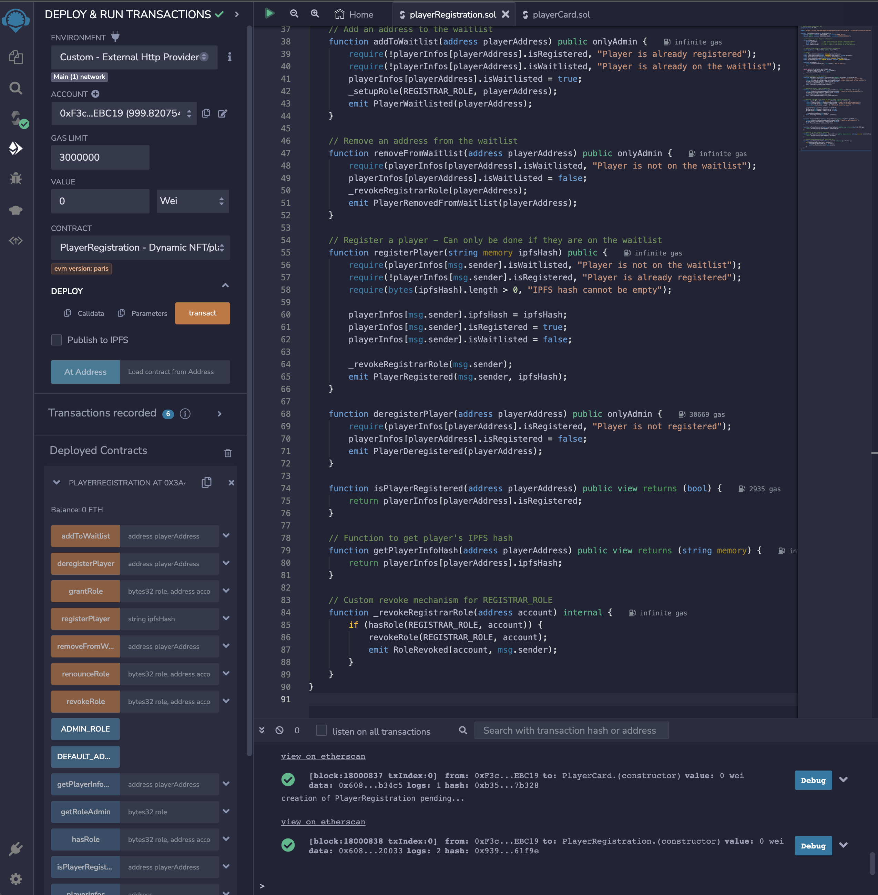
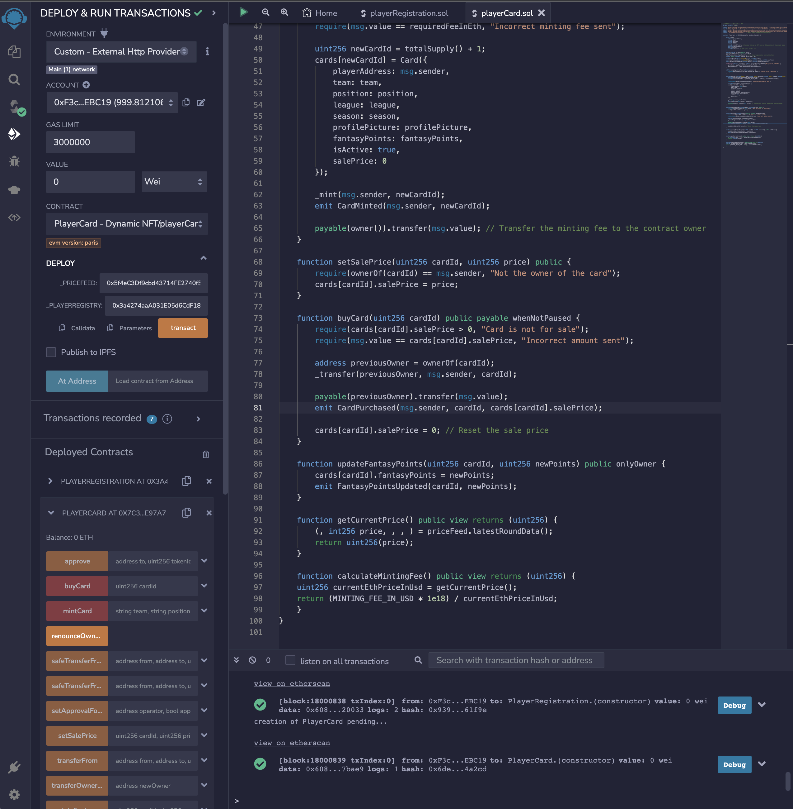

# hodler-fantasy-dapp
A decentralized fantasy soccer platform powered by Ethereum and IPFS, where users build dynamic teams using tokenized players (Dynamic NFTs). These Dynamic NFTs, representing player cards, can update their fantasy points after each game, reflecting the real-world performance of the players.

## Project Description

The `hodler-fantasy-dapp` offers a unique blend of fantasy soccer and blockchain technology. Users can own, trade, and compete using tokenized player cards. These cards aren't static; their value and attributes (like fantasy points) can change based on real-world events, thanks to the integration with Chainlink oracles.

### Smart Contracts:

#### 1. `playerRegistration.sol`:

**Purpose**:  
This contract manages the registration of players on the platform.

**Key Features**:
- Allows players to be added to a waitlist.
- Enables players on the waitlist to register themselves using their personal details stored on IPFS.
- Provides roles for admin and registrar to manage registrations.
  
#### 2. `playerCard.sol`:

**Purpose**:  
Handles the tokenization of players into dynamic NFTs (player cards) and manages the attributes associated with each card.

**Key Features**:
- Allows users to mint new player cards if they are registered players.
- Each card can have its fantasy points updated, making them dynamic.
- Player cards can be listed for sale and purchased by others.
- Integrates with Chainlink oracles to get the current ETH price, which helps in calculating the minting fee.

### Backend Service:

#### `app.py`:

**Purpose**:  
Serves as the backend service for the platform, interfacing with the Ethereum blockchain to facilitate user interactions.

**Key Features**:
- Allows players to register themselves, providing their details and a selfie.
- Offers a UI for users to mint their player cards.
- Interacts with the smart contracts using the web3.py library.
- Integrates with IPFS through the `pinata` module to store and retrieve off-chain data.
  
---

### Setting Up and Deploying Smart Contracts using Ganache and Remix

When developing Ethereum applications, especially those that utilize Chainlink Oracle Price Feeds, it's important to have an environment that mimics the mainnet, especially since Chainlink Oracles don't typically have data feeds for local blockchains like Ganache. For this reason, we opt to fork the Ethereum mainnet to our local Ganache instance. This allows us to have all the mainnet state, including the Chainlink Oracles, available for local development.

#### 1. Install nvm (Node Version Manager)

**Why nvm?**  
nvm allows you to install, manage, and work with multiple versions of Node.js.

**Instructions**:
```bash
curl -o- https://raw.githubusercontent.com/nvm-sh/nvm/v0.39.1/install.sh | bash
```
Then, reopen your terminal or run:
```bash
export NVM_DIR="$HOME/.nvm"
[ -s "$NVM_DIR/nvm.sh" ] && \. "$NVM_DIR/nvm.sh"
```

#### 2. Install Ganache

**Why Ganache?**  
Ganache is a personal Ethereum blockchain which you can use to run tests, execute commands, and inspect state while controlling how the chain operates.

**Instructions**:
```bash
npm install -g ganache-cli
```

#### 3. Setting up Infura

**Why Infura?**  
Infura provides a remote Ethereum node infrastructure, allowing you to run your application without requiring you to set up your own Ethereum node.

**Instructions to create an Infura account**:
1. Visit [Infura](https://infura.io/) and sign up for a new account.
2. Once logged in, click on "Create New Project".
3. Name your project and you'll be provided with an endpoint URL for the Ethereum mainnet.

**How to copy the Infura URL**:
- After creating a project, under the "Keys" section, you will see your `PROJECT ID`. The mainnet URL will look like this: `https://mainnet.infura.io/v3/YOUR_PROJECT_ID`.

#### 4. Run Ganache with Infura

**Instructions**:
```bash
ganache-cli --fork=<INFURA_URL>
```
Replace `<INFURA_URL>` with your Infura endpoint.

This will start a local Ethereum blockchain instance which is a fork of the current mainnet state. It allows you to interact with it as if you were on the mainnet, but without any real transactions or costs.

#### 5. Deploying Contracts with Remix

1. Visit [Remix](https://remix.ethereum.org/).
2. Write or import your smart contracts.
3. In the "Deploy & Run Transactions" tab:
   - For **Environment**, select "Custom - External Http Provider".
   - A popup will ask for the Web3 Provider Endpoint. Enter `http://127.0.0.1:8545` and click "OK".
   - Make sure you're connected to the right account in MetaMask (should be one of the Ganache accounts for local deployment).
4. Deploy `playerRegistration` contract normally.
5. Note down the deployed contract address of `playerRegistration`. This will be used as `_PLAYERREGISTRY` when deploying the `PlayerCard` contract.
6. Deploy `PlayerCard` contract. When deploying, you'll need:
   - `_PRICEFEED`: This would be the Chainlink Price Feed contract address on mainnet (since you're forking mainnet). For ETH/USD, you can use: `0x5f4eC3Df9cbd43714FE2740f5E3616155c5b8419`.
   - `_PLAYERREGISTRY`: Use the address of the `playerRegistration` contract you deployed in the previous step.

---

### Deployment Media

To better understand the deployment and interaction processes, here are some visual aids:

#### Deploying Smart Contracts:

**Deploying PlayerRegistration Contract**



In this screenshot, you'll see the deployment process of the `playerRegistration` contract using Remix on the Ganache fork of the mainnet.

**Deploying PlayerCard Contract**



This captures the deployment of the `playerCard` contract. Remember to specify the Chainlink Oracle Price Feed and the address of the previously deployed `playerRegistration` contract.

#### Streamlit Interface Interactions

**Player Registration**

[Player Registration in Streamlit Video](resources/videos/Player_Registration_Streamlit.mp4)

Click to view the video demonstrating the Streamlit interface for player registration. Players provide details and a selfie, which gets stored on IPFS, with the resulting hash saved on the Ethereum blockchain.

**Minting Player Cards**

[Mint Player Card in Streamlit Video](resources/videos/Mint_PlayerCard_Streamlit.mp4)

Click to view the video showcasing the process for registered players to mint unique player cards as NFTs through this interface. The cards' attributes can dynamically update, offering a unique value proposition over traditional NFTs.

---

## Roles and Permissions in the PlayerRegistration Contract

The PlayerRegistration contract is designed with a role-based access system to ensure that specific functionalities are accessible only to authorized accounts. Here's a breakdown of the roles and their permissions:

1. **Accounts with `DEFAULT_ADMIN_ROLE` or `ADMIN_ROLE`**: 
   - Can add addresses to the waitlist using `addToWaitlist`.
   - Can remove addresses from the waitlist using `removeFromWaitlist`.
   - Can deregister players using `deregisterPlayer`.
   
2. **Accounts with `REGISTRAR_ROLE`**:
   - Can register themselves as players using `registerPlayer`.
   - Once they've registered themselves, they will lose the `REGISTRAR_ROLE`.

3. **Accounts without any role**:
   - Cannot add others to the waitlist.
   - Cannot register themselves unless they have been added to the waitlist by an admin and thus given the `REGISTRAR_ROLE`.

In practical terms, when using the Streamlit app:

- If the selected account has the `ADMIN_ROLE`, you should provide functionalities to add/remove addresses from the waitlist and deregister players.
  
- If the selected account has the `REGISTRAR_ROLE` (i.e., is on the waitlist), you should provide the functionality to register themselves.

- If the selected account doesn't have any role, it shouldn't have any special functionality beyond viewing data.

---

## Configuration File Explanation (`SAMPLE.env`)

For the `hodler-fantasy-dapp` backend service (`app.py`) to function correctly, you'll need to provide specific environment variables. These are stored in a `.env` file, but for clarity and sample purposes, we've provided a `SAMPLE.env`. Below is an explanation of each variable:

#### 1. `PINATA_API_KEY`:
**Description**:  
Your API key for the Pinata service. 

**Why?**:  
Pinata is a service that allows you to easily store data on the IPFS (InterPlanetary File System). We use it to store off-chain data, like player's personal details and selfies.

**How to get one?**:  
- Visit [Pinata](https://pinata.cloud/).
- Sign up or log in.
- Navigate to the "API Key" section and generate a new key.

#### 2. `PINATA_SECRET_API_KEY`:
**Description**:  
The secret API key corresponding to the `PINATA_API_KEY` you generated.

**Why?**:  
For added security, Pinata requires both an API key and a secret key for authentication.

#### 3. `WEB3_PROVIDER_URI`:
**Description**:  
The URI of your Ethereum node provider.

**Why?**:  
To interact with the Ethereum blockchain, the backend service needs to connect to an Ethereum node. This URI points to that node.

**How to get one?**:  
- If you're using Infura, it will be your Infura endpoint (similar to the one you used to fork the mainnet with Ganache).
- If you have a local Ethereum node, it could be something like `http://127.0.0.1:8545`.

#### 4. `PLAYER_REGISTRATION_CONTRACT_ADDRESS`:
**Description**:  
The Ethereum address where the `playerRegistration.sol` contract is deployed.

**Why?**:  
To interact with the contract, the backend service needs to know its address.

**How to get one?**:  
- Once you deploy the `playerRegistration` contract, the address will be displayed in your Ethereum wallet or on Remix.

#### 5. `PLAYER_CARD_CONTRACT_ADDRESS`:
**Description**:  
The Ethereum address where the `playerCard.sol` contract is deployed.

**Why?**:  
Similar to the `playerRegistration` contract, the backend needs this address to interact with the `playerCard` contract.

**How to get one?**:  
- After deploying the `PlayerCard` contract, the address will be displayed in your Ethereum wallet or on Remix.
